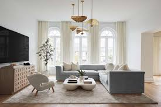
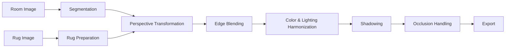
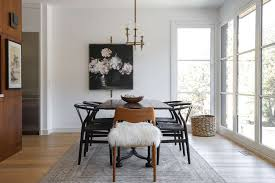

# AI‑Powered Interior Visualization Toolkit

Segmentation‑aware rug insertion with perspective correction, soft‑edge blending, lighting harmonization, and occlusion handling. The toolkit aims to generate photorealistic interior visualizations where rugs integrate seamlessly into room photographs.

---

## Contents

* [Overview](#overview)
* [Why This Is Hard](#why-this-is-hard)
* [Repository Structure](#repository-structure)
* [Quickstart (Kaggle‑Friendly)](#quickstart-kagglefriendly)
* [Pipeline](#pipeline)
* [Results Gallery](#results-gallery)
* [Design Principles & Methodology](#design-principles--methodology)
* [Evaluation](#evaluation)
* [Limitations](#limitations)
* [Roadmap](#roadmap)
* [Reproducibility](#reproducibility)
* [Acknowledgements & References](#acknowledgements--references)
* [License](#license)

---

## Overview

This repository provides a complete pipeline for inserting rug designs into interior photographs with realism. The challenge of rug compositing is not simply pasting an image; it requires respecting geometry, lighting, and scene context. Each stage of the pipeline is modular so components (segmentation, blending, lighting) can be swapped or improved independently.

<p align="center">
  
  
  
</p>

The three images above summarize the workflow: the original room photo, the segmentation of the floor and occluders, and the final rug insertion. This pipeline is designed to handle not only geometric alignment but also photometric consistency and depth layering, making outputs suitable for realistic design visualization.

---

## Why This Is Hard

Compositing a rug into a room photo involves multiple technical hurdles:

**Geometry.** The rug must conform to the floor plane. Without perspective correction, rugs look like stickers floating above the scene.

**Texture Integrity.** Rugs often have intricate patterns. Naïve scaling blurs these details; our pipeline tiles textures while smoothing seams to preserve fidelity.

**Photometry.** Rooms vary in lighting, color casts, and brightness gradients. A red rug should remain recognizably red, but must also blend with ambient illumination.

**Boundaries.** Floor boundaries are rarely perfect rectangles. Hard rug edges reveal compositing. Feathered blending around edges reduces discontinuity.

**Depth Ordering.** Objects like beds and sofas must occlude rugs where appropriate. Occluder masks enforce correct z‑ordering.

**Shadows.** Subtle shadows visually anchor rugs to the floor and improve realism.

---

## Repository Structure

```
.
├── Input_Images/            # Room photos, rug textures, optional masks
├── output_images/           # Generated composites
├── high-resolution-rug-insertion-image.ipynb
├── rug-insertion-image-lowres.ipynb
├── README.md
└── LICENSE
```

---

## Quickstart (Kaggle‑Friendly)

1. Place room and rug images into `Input_Images/`.
2. Open `rug-insertion-image-lowres.ipynb` (for a quick run) or `high-resolution-rug-insertion-image.ipynb` (for the full pipeline).
3. Run all cells; composites will appear in `output_images/`.

This project is fully compatible with Kaggle environments, which already include OpenCV, NumPy, and Matplotlib.

---

## Pipeline



### Segmentation

Segmentation isolates the floor plane and occluding objects. We use Segment Anything (SAM) or manual masks. Morphological cleaning (open/close operations) reduces noise. Quality is crucial: masks with smooth boundaries minimize blending artifacts.

### Rug Preparation

Rug images are tiled to maintain resolution across large areas. Overlapping seams are smoothed with cosine ramps, ensuring no visible joins. Scaling factors adapt to room size and resolution.

### Perspective Transformation

We compute a homography `H` using four floor‑corner correspondences. The rug is warped via `cv2.warpPerspective`, ensuring alignment with the floor plane. Regularization toward an affine transform prevents extreme distortions in near‑degenerate cases.

```
[x', y', 1]^T  ~  H · [x, y, 1]^T   with   H ∈ R^{3×3}
```

### Edge Blending

A distance transform on the floor mask generates a smooth alpha ramp around boundaries. Feathering ensures rugs blend seamlessly into the floor rather than appearing pasted.

```
I_out(p) = α(p) * I_rug(p) + (1 - α(p)) * I_room(p)
```

### Color & Lighting Harmonization

The rug’s colors are aligned to the room by channel‑wise mean/variance matching in LAB color space. Low‑frequency lighting gradients are modeled to match shading. This balances global color consistency with preservation of the rug’s distinctive palette.

### Shadowing

Shadows are synthesized using blurred, offset rug masks. Shadow intensity is modulated by local luminance to ensure consistency across bright and dark regions of the floor.

### Occlusion Handling

Foreground masks (beds, sofas) are reapplied after rug compositing. This enforces correct scene depth and prevents rugs from overlapping furniture.

### Export

Final composites are written to `output_images/`. Filenames encode room and rug identifiers for traceability.

---

## Results Gallery

<table>
<tr>
<td><br><sub>Original Room</sub></td>
<td><br><sub>Composite with Rug</sub></td>
</tr>
<tr>
<td><br><sub>Original Room</sub></td>
<td><br><sub>Composite with Rug</sub></td>
</tr>
</table>

<p align="center">
  <br>
  <sub>Segmentation Example: floor (green) and occluders (red)</sub>
</p>

---

## Design Principles & Methodology

This toolkit was designed with the following principles:

**Modularity.** Each stage—segmentation, warp, blending, harmonization, occlusion—is independent, making the system extensible.

**Data‑driven defaults.** Parameters like feather width and tiling density adapt dynamically to image size and mask scale, avoiding manual tuning.

**Visual checkpoints.** Notebooks render intermediate previews after key stages, allowing quick inspection and manual correction.

**Identity preservation.** Rugs retain their design identity. Harmonization is gentle, avoiding over‑correction that would wash out rug color.

---

## Evaluation

Evaluation combines quantitative and qualitative assessments:

* **Boundary Continuity.** Gradient continuity across rug edges is checked to ensure seamless blending.
* **Perceptual Metrics.** SSIM and LPIPS quantify realism compared to references.
* **Human Study.** Users score composites on realism (1–5) with focus on lighting, boundaries, and rug integration.

---

## Limitations

* Highly reflective or glossy floors are not explicitly modeled, so reflections may appear inconsistent.
* Extreme perspective distortions may require manual input for homography.
* Strong colored lighting can still affect rug harmonization.

---

## Roadmap

* Interactive segmentation editor with click‑based UI.
* Automatic vanishing point detection for robust perspective estimation.
* Gradient‑domain blending for challenging boundaries.
* More advanced shadow synthesis informed by light estimation.
* Batch processing and transparent rug exports.

---

## Reproducibility

Reproducibility is key for visual ML pipelines:

* Capture environment versions (OpenCV, NumPy, PyTorch).
* Record pipeline parameters and save them alongside results.
* Use deterministic interpolation for perspective warps.

Example snippet for recording versions:

```python
import sys, cv2, numpy as np
print({
    'python': sys.version,
    'opencv': cv2.__version__,
    'numpy': np.__version__,
})
```

---

## Acknowledgements & References

* **Segment Anything (SAM)** — Kirillov et al., Meta AI.
* **ControlNet** — Zhang & Agrawala et al.
* **Multiple View Geometry in Computer Vision** — Hartley & Zisserman.

---

## License

MIT License. See `LICENSE` for details.
