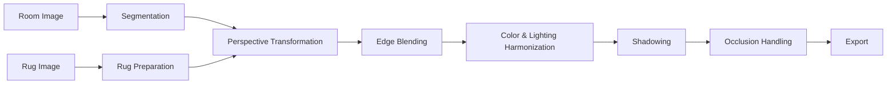

# AI‑Powered Interior Visualization Toolkit

Segmentation‑aware rug insertion with perspective correction, soft‑edge blending, lighting harmonization, and occlusion handling. The toolkit aims to generate photorealistic interior visualizations where rugs integrate seamlessly into room photographs.

---

## Contents

* [Overview](#overview)
* [Why This Is Hard](#why-this-is-hard)
* [Repository Structure](#repository-structure)
* [Quickstart (Kaggle‑Friendly)](#quickstart-kagglefriendly)
* [Pipeline](#pipeline)
* [Results Gallery](#results-gallery)
* [Design Principles & Methodology](#design-principles--methodology)
* [Evaluation](#evaluation)
* [Limitations](#limitations)
* [Roadmap](#roadmap)
* [Reproducibility](#reproducibility)
* [Acknowledgements & References](#acknowledgements--references)
* [License](#license)

---

## Overview

This repository contains a modular pipeline for inserting rug designs into indoor images while respecting scene geometry, photometry, and depth ordering. The system is organized so each stage can be improved independently (e.g., replace segmentation, swap blending method) without breaking the rest of the pipeline.

<p align="center">
  
  
  
</p>

---

## Why This Is Hard

* **Geometry**: The rug must sit on the floor plane with correct perspective.
* **Texture Integrity**: Scaling a single rug bitmap stretches patterns; tiling with seam blending preserves detail.
* **Photometry**: Inserted content must match room brightness, contrast, and color balance.
* **Boundaries**: Hard edges reveal cut‑and‑paste compositing. Feathered edges reduce discontinuities.
* **Depth Ordering**: Foreground objects (beds, sofas) should occlude the rug.
* **Shadows**: Subtle shadowing anchors the rug to the floor.

---

## Repository Structure

```
.
├── Input_Images/            # Room photos, rug textures, optional masks
├── output_images/           # Generated composites
├── high-resolution-rug-insertion-image.ipynb
├── rug-insertion-image-lowres.ipynb
├── README.md
└── LICENSE
```

---

## Quickstart (Kaggle‑Friendly)

1. Place room and rug images into `Input_Images/`.
2. Open `rug-insertion-image-lowres.ipynb` (quick pass) or `high-resolution-rug-insertion-image.ipynb` (full pipeline).
3. Run all cells; composites will appear in `output_images/`.

---

## Pipeline



### Perspective Transformation

We map the prepared rug texture to the floor plane using a homography $H$ from four point correspondences (rug corners → floor corners). In homogeneous coordinates:

$$
\begin{bmatrix}x' \\ y' \\ 1\end{bmatrix} \sim H \begin{bmatrix}x \\ y \\ 1\end{bmatrix}, \quad H \in \mathbb{R}^{3\times3}
$$

We estimate $H$ via Direct Linear Transform (DLT) and apply `cv2.warpPerspective`. If needed, we stabilize the warp with slight regularization toward an affine transform to avoid extreme skew when points are nearly collinear.

### Edge Blending

Feathering is applied to rug–floor boundaries. A Gaussian falloff based on distance to the boundary ensures smooth transitions.

### Color & Lighting Harmonization

Histogram matching in LAB color space aligns rug brightness and chroma with the room, while preserving the rug’s identity.

### Shadows & Occlusion

A blurred offset of the rug mask produces soft shadows. Foreground occluder masks are reapplied after compositing to maintain depth realism.

---

## Results Gallery

<table>
<tr>
<td><br><sub>Room</sub></td>
<td><br><sub>Composite</sub></td>
</tr>
<tr>
<td><br><sub>Room</sub></td>
<td><br><sub>Composite</sub></td>
</tr>
<tr>
<td colspan="2"><br><sub>Segmentation Mask Example</sub></td>
</tr>
</table>

---

## Design Principles & Methodology

* **Modularity**: each stage (segmentation, warp, blending, photometry, depth) is replaceable.
* **Data‑driven defaults**: parameters (feather widths, tiling dpi) adapt to input image scale.
* **Visual checkpoints**: previews after major stages allow human verification.
* **Identity preservation**: rug colors remain true while softly matched to scene illumination.

---

## Evaluation

* **Boundary Continuity**: gradient checks across rug edges.
* **SSIM/LPIPS**: perceptual realism against references.
* **Human Rating**: subjective realism scoring.

---

## Limitations

* Glossy floors not explicitly modeled.
* Extreme perspective requires manual homography input.
* Strong color casts may still influence harmonization.

---

## Roadmap

* Interactive segmentation UI.
* Automatic vanishing point detection.
* Gradient‑domain blending.
* Improved shadow synthesis with light estimation.
* Batch/CLI support, transparent rug exports.

---

## Reproducibility

* Save environment versions (OpenCV, NumPy, PyTorch).
* Record run configuration as JSON with outputs.
* Use deterministic interpolation for warps.

---

## Acknowledgements & References

* Segment Anything (SAM)
* ControlNet
* Hartley & Zisserman, *Multiple View Geometry in Computer Vision*

---

## License

MIT License. See `LICENSE` for details.
