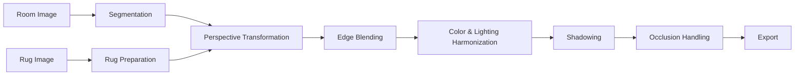

# AI‑Powered Interior Visualization Toolkit

Segmentation‑aware rug insertion with perspective correction, soft‑edge blending, lighting harmonization, and occlusion handling. The toolkit aims to generate photorealistic interior visualizations where rugs integrate seamlessly into room photographs.

---

## Contents

* [Overview](#overview)
* [Why This Is Hard](#why-this-is-hard)
* [Repository Structure](#repository-structure)
* [Quickstart (Kaggle‑Friendly)](#quickstart-kagglefriendly)
* [Pipeline](#pipeline)

  * [1. Inputs & Normalization](#1-inputs--normalization)
  * [2. Segmentation](#2-segmentation)
  * [3. Rug Preparation (Scale & Tiling)](#3-rug-preparation-scale--tiling)
  * [4. Perspective Transformation](#4-perspective-transformation)
  * [5. Edge Blending](#5-edge-blending)
  * [6. Color & Lighting Harmonization](#6-color--lighting-harmonization)
  * [7. Shadowing](#7-shadowing)
  * [8. Occlusion Handling](#8-occlusion-handling)
  * [9. Export & Naming](#9-export--naming)
* [Results Gallery](#results-gallery)
* [Design Principles & Methodology](#design-principles--methodology)
* [Evaluation](#evaluation)
* [Limitations](#limitations)
* [Roadmap](#roadmap)
* [Reproducibility](#reproducibility)
* [Acknowledgements & References](#acknowledgements--references)
* [License](#license)

---

## Overview

This repository contains a modular pipeline for inserting rug designs into indoor images while respecting scene geometry, photometry, and depth ordering. The system is organized so each stage can be improved independently (e.g., replace segmentation, swap blending method) without breaking the rest of the pipeline.

<p align="center">
  
  
  
</p>

> **Note**: Replace `output_images/LivingRoom1_result.jpg` with the actual filename produced in your run.

---

## Why This Is Hard

* **Geometry**: The rug must sit on the floor plane with correct perspective. A naïve paste‑in looks flat or floats.
* **Texture Integrity**: Scaling a single rug bitmap often stretches patterns. Tiling with seam management preserves detail.
* **Photometry**: Inserted content must match room brightness, contrast, and color balance to avoid looking synthetic.
* **Boundaries**: Hard edges reveal cut‑and‑paste compositing. Feathered edges reduce visual discontinuities.
* **Depth Ordering**: Foreground objects (beds, sofas) should occlude the rug, not the other way around.
* **Shadows**: Subtle shadowing anchors the rug to the floor and improves realism significantly.

---

## Repository Structure

```
.
├── Input_Images/            # Room photos, rug textures, optional masks
├── output_images/           # Generated composites
├── high-resolution-rug-insertion-image.ipynb
├── rug-insertion-image-lowres.ipynb
├── README.md
└── LICENSE
```

> Tip: If you want consistent linking on GitHub, keep file names URL‑safe (avoid spaces) or URL‑encode them (e.g., `Room%20Segment.png`).

---

## Quickstart (Kaggle‑Friendly)

1. Place room and rug images into `Input_Images/`.
2. Open `rug-insertion-image-lowres.ipynb` (for a quick pass) or `high-resolution-rug-insertion-image.ipynb` (for the full pipeline).
3. Run all cells; composites will appear in `output_images/`.

> Kaggle typically includes recent `opencv-python`, `numpy`, and `matplotlib`. If you add SAM/ControlNet later, pin versions in the first cell.

---

## Pipeline



### 1. Inputs & Normalization

* **Room image**: JPEG/PNG in `Input_Images/`.
* **Rug image**: Preferably high‑resolution, with pattern aligned horizontally.
* Optional **masks**: Floor and occluders as binary PNGs (white = keep). If none provided, we derive them in the notebook.
* All images are read as RGB in the working color space (sRGB), normalized to `[0,1]` float arrays for processing.

### 2. Segmentation

Goal: isolate **floor** and **occluders**.

* Floor mask can be produced by Segment Anything (SAM) + manual refinement, or by hand (polygon selection).
* Occluder masks (bed/sofa/table) are separate; they will be layered atop the final rug during compositing.
* **Post‑processing**: morphological open/close to remove speckles; optional convex‑hull cleanup for floor.

**Quality heuristic**: The ratio of boundary pixels to mask area should be small (jagged masks amplify edge artifacts). We log mask perimeter/area to flag outliers.

### 3. Rug Preparation (Scale & Tiling)

Problem: A single rug bitmap stretched across a large floor looks blurry. Solution: **tile** the rug texture prior to warping.

* We compute a target floor coverage area (in pixels) and select a tiling factor `t_x × t_y` so that per‑tile resolution remains above a minimum dpi.
* **Seam strategy**: overlap neighboring tiles by `k` pixels and blend with a cosine ramp
  $\alpha(x) = \tfrac{1-\cos(\pi x/k)}{2}$ for `x∈[0,k]` to hide borders.

### 4. Perspective Transformation

We map the prepared rug texture to the floor plane using a homography `H` from four point correspondences (rug corners → floor corners). In homogeneous coordinates:

$$
\begin{bmatrix}x'\\y'\\1\end{bmatrix} \sim
H \begin{bmatrix}x\\y\\1\end{bmatrix},\quad
H \in \mathbb{R}^{3\times3}
$$

We estimate `H` via Direct Linear Transform (DLT) and apply `cv2.warpPerspective`. If needed, we stabilize the warp with slight regularization toward an affine transform to avoid extreme skew when points are nearly collinear.

### 5. Edge Blending

Hard edges reveal the composite. We construct a **feather mask** by computing the distance `d(p)` from each floor‑mask boundary pixel and applying a Gaussian falloff:

$\alpha(p) = \exp\big(-\tfrac{d(p)^2}{2\sigma^2}\big)$

Final per‑pixel blend:

$I_{out}(p) = \alpha(p)\,I_{rug}(p) + (1-\alpha(p))\,I_{room}(p).$

Edge width `σ` is adaptively chosen based on local floor texture contrast (wider feather where the floor is more textured).

### 6. Color & Lighting Harmonization

We align the rug’s appearance with the room using channel‑wise statistics in **LAB** color space:

$I'_{c} = \frac{\sigma_{room,c}}{\sigma_{rug,c}}\,(I_{rug,c}-\mu_{rug,c}) + \mu_{room,c},\quad c\in\{L,a,b\}.$

Optional refinements:

* White‑balance normalization for rooms with strong color casts.
* Low‑frequency illumination matching: fit a 2‑D polynomial to the room’s luminance and modulate the rug accordingly.

### 7. Shadowing

To anchor the rug physically, we synthesize a soft shadow using a blurred and slightly offset alpha map:

* Direction: chosen manually or estimated by analyzing room edges and highlights.
* Intensity: proportional to local room luminance to avoid pitch‑black artifacts on bright floors.

### 8. Occlusion Handling

We ensure depth correctness by re‑applying occluder masks **after** the rug composite:

$I_{final} = O\cdot I_{room} + (1-O)\cdot I_{out},$

where `O` is the (possibly feathered) occluder mask. A small feather on `O` prevents haloing along furniture edges.

### 9. Export & Naming

* Results are written to `output_images/`.
* Suggested naming: `{RoomID}_rug-{RugID}_v{N}.jpg` (e.g., `LivingRoom1_rug-r1_v1.jpg`).
* Preserve the pipeline parameters (tiling, σ, color mode) in a sidecar JSON for reproducibility.

---

## Results Gallery

Below are example slots you can populate as you generate outputs. Replace filenames as needed.

<table>
<tr>
<td><br><sub>Room</sub></td>
<td><br><sub>Composite</sub></td>
</tr>
<tr>
<td><br><sub>Room</sub></td>
<td><br><sub>Composite</sub></td>
</tr>
<tr>
<td><br><sub>Segmentation / Mask Example</sub></td>
<td><br><sub>Mask Overlay (placeholder)</sub></td>
</tr>
</table>

> For large assets, consider enabling [Git LFS](https://git-lfs.com/):
>
> ```bash
> git lfs install
> git lfs track "*.png" "*.jpg" "*.jpeg"
> git add .gitattributes
> ```

---

## Design Principles & Methodology

* **Modularity first**: each stage (segmentation, warp, blending, photometry, depth) is independently replaceable.
* **Data‑driven defaults**: thresholds (feather widths, tiling dpi) are derived from image size and floor mask scale.
* **Predictable fallbacks**: when automated cues fail (e.g., vanishing line estimates), the notebook exposes manual controls rather than stalling.
* **Visual checkpoints**: after every major stage, the notebook renders intermediary previews (mask, warped rug, alpha edges) for human verification.
* **Conservative photometry**: color harmonization is designed to preserve the rug’s identity (e.g., red rug remains red) while softly matching scene illumination.

---

## Evaluation

Suggested quantitative and qualitative checks to track improvements over time:

**Quantitative**

* **Boundary Contrast Continuity**: gradient magnitude along the rug boundary before/after; aim for minimal discontinuity.
* **SSIM/LPIPS**: if you maintain references for A/B comparisons (e.g., relit ground‑truth composites), report perceptual similarity.
* **Mask Metrics**: boundary‑to‑area ratio, hole count — indicators of segmentation quality.

**Qualitative**

* Side‑by‑side reviews at 100% zoom.
* Human rating study (1–5) on realism; collect comments on lighting, edges, and shadowing.

---

## Limitations

* Highly reflective/glossy floors are not explicitly modeled (reflections and specular highlights may require environment‑aware rendering).
* Extreme perspective or fisheye lenses degrade homography stability (requires more robust plane estimation).
* Strong colored lighting can still tint results; advanced relighting or HDR estimation may be needed.

---

## Roadmap

* Interactive, click‑based segmentation UI with immediate visual feedback.
* Automatic vanishing‑point detection for robust plane estimation.
* Poisson or gradient‑domain blending as an alternative to feathering for challenging boundaries.
* Advanced shadow synthesis informed by approximate light direction and softness.
* Batch processing/CLI; optional transparent exports with alpha.

---

## Reproducibility

* Record library versions at runtime (OpenCV, NumPy, PyTorch if used).
* Fix random seeds for any stochastic steps.
* Save run configuration (JSON) alongside outputs.
* Use deterministic interpolation modes for warps (OpenCV’s bilinear).

Example environment capture snippet (to include in notebooks):

```python
import sys, cv2, numpy as np
print({
    'python': sys.version,
    'opencv': cv2.__version__,
    'numpy': np.__version__,
})
```

---

## Acknowledgements & References

* Segment Anything (SAM) — Kirillov et al., Meta AI.
* ControlNet — Zhang & Agrawala et al.
* Hartley & Zisserman — *Multiple View Geometry in Computer Vision* (for homography fundamentals).

---

## License

MIT License. See `LICENSE` for details.
